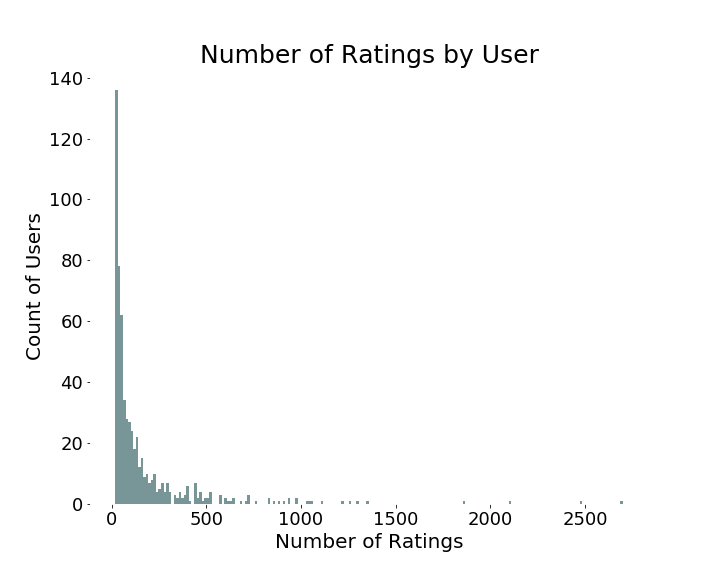
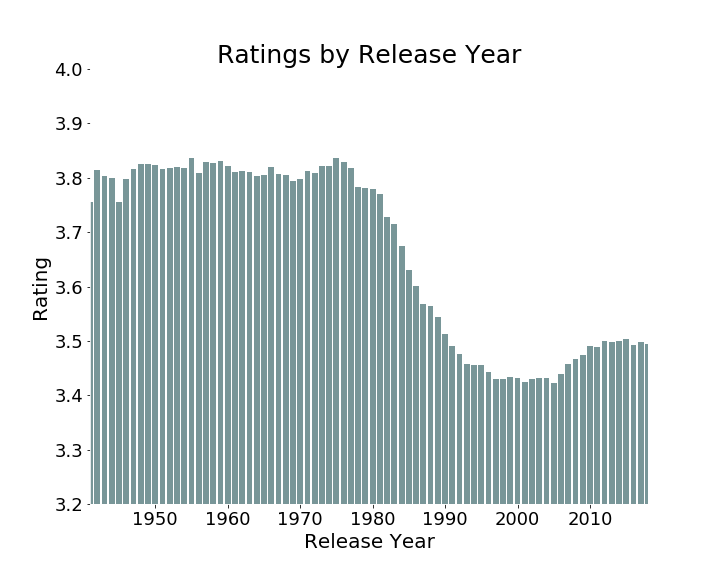

# Rate 5, Get 5 - Recommendation System Project 

by Leana Critchell, Jacob Prebys and Dann Morr

### Overview

We aim to create a recommendation system based on the MovieLens dataset from the GroupLens research lab at the University of Minnesota. Furthermore, we would like to deploy a web app that will alloy a user to enter some ratings for movies that they have seen, and then, based on the model we have implemented, it will reccomend movies that align with their interests. 

### Success Criteria

Success will be measured by implementing collaborative and content-based models that can return movie recommendations to a user. The goal is to provide reviews that we find sensible based on either reviews that the user enters, or based on a film given to the content-based system. A good recommendation algorithm can be extremely useful for streaming companies, as a constant stream of accurate or interesting recommendations will keep users engaged with the platform.

### Members

|         Name             |                  GitHub          | 
|--------------------------|----------------------------------|
|Leana Critchell           | [lecritch](https://github.com/lecritch)|
|Jacob Prebys              | [jprebys](https://github.com/jprebys)|
|Dann Morr                 | [dannmorr](https://github.com/dannmorr)|

### Our Data

The datasets used can be found [here](https://grouplens.org/datasets/movielens/latest/). There is a complete dataset available here which includes over 27,000,000 reviews. They also offer a subset of this data that has about 100,000 reviews. For our initial data exploration and model tuning, we will be using this subset.

You can click [this link](http://files.grouplens.org/datasets/movielens/ml-latest-small.zip) to download the zip file of the data files used in this project (1MB).  This zip file contains 4 csv files:  `movies`, `ratings`, `tags` and `links`.  See the README.md in the [data](../../data) folder for more info on how this data is formatted.  On the website provided above,  you also have access to the 'large' dataset which is 256MB and was not used in this project.  Download from their website at your own will.  

The four csv datasets were downloaded to this repo which you can find [here](../../data) - they are labelled `movies.csv`, `links.csv`, `ratings.csv` and `tags.csv`.  If you're following along in the final notebook, the cells will run as we import the csv's using pandas. 

### Metrics

For this recommendation system, we are provided with actual ratings that actual users gave to movies. Because we have a numerical rating system, the standard metrics for regression problems apply here. Calculating the root mean squared error (RMSE) is a natural choice for model evaluation, but there are problems in practice with this method. Most notably, the movies that have few ratings don't have much affect on the RMSE; therefore, we will have to take this into consideration when tuning the model.

### Modeling

#### Collaborative Filtering Model:

The Co

#### Content-Based Model:

The next type of recommendation system we wanted to explore was a content-based version. Our previous model would look at other users that have similar interests, and it would recommend other titles that they have liked. This system goes the other direction and it takes movies that you like, and, having learned some information about the film, recommends titles that are similar to it.

To do this, we gathered descriptions and genre tags for each film, and then utilized some of Python's natural language processing tools to turn this text information into numerical information. We used the following process:

 1. **TF-IDF Vectorization**
   - Short for Term Frequency - Inverse Document Frequency, this is a method for assigning values to each word based on the amount of times it appear in documents. This specific value takes in to account the number of times a word appears in a single description and also how commonly it appears in all descriptions. In a single description, a word is given a high tf-idf score if it appears many times in one description, but it is relatively uncommon across all descriptions. This is partially meant to filter out words that are common to movies in general.
   
   
 2. **Cosine Similarity**
  - Once each film is represented by a many-dimensional vector, a common method for determining how 'similar' two films are is by caluculating how close to 1 the cosine of the angle between them is.
  
  
 3. **Sorting**
  - Now that we have a measure of similarity between every pair of movies, we can take in a single movie, sort the rest of the movies by how similar they are to our chosen film, and then return the top 10 most similar films.
  
  
We have put together a Python class to demonstrate our content-based recommender, the source code for it can be found in the src folder under the name [content_rec.py](../../src/content_rec.py). 

### Evaluation

Overall our models were successful in providing good recommendations to users. Our final model had a root mean squared error of 0.855, but that could be improved through further model iterations and perhaps some integrations of the content-based system into the collaborative one.

### Deployment

To deploy our recommendation system we decided to use the Python library Flask, which is a framework for making simple web-apps backed with Python code. With this tool we were able to make a cool app that will ask users to rate a certain number of movies, and it will recommend films based on similar users' interests.

Here's an app preview:

### Home Page

### Recommendations Page

### Directory Structure:

# enter table of contents or directory structure details here

### Data Overview

#### Distribution of Data:

We found the average rating is 3.5 and the data is left-skewed as can be seen in the image below.  This shows us that there aren't many low ratings between 0.5 and 2.  Perhaps this says something about the motivation for people to rate movies and that people only rate movies they enjoy.

Something that comes up a lot in recommendation system problems is the long tail problem.  This is where we have a fast majority of users and/or items that only have 1 rating associated to them and a small amount of items/users that have a lot of ratings associated with them.  We first looked into the number of ratings per movie:

As you can see we do have a long tail problem here where the majority of movies have less than 25 ratings and very few have more than that.

We then looked into the number of ratings per user to investigate this long tail problem further:

#### Top 10 Genres 

We looked into the most common genres and found the top ten genre combinations (that is, the genre with the most amount of movies listed as this genre).

We found that the top movies boil down to:

- Drama
- Crime/Thriller
- Comedy

We visualise the top 10 genres:

We can see here that Drama is the most highly rated genre, second is Comedy and third Comedy|Drama. This along suggests that these could be aggregated some how and should be considered in future investigations.

#### Ratings by Release Year

From this graph we can see that movies that were released before 1990 tend to have a higher average rating. From roughly 1990, the average movie rating appears to trend downwards towards the average rating of the dataset (3.5). Since the rating of these movies have taken place since 1993, this could suggest that people who watched and rated older movies, watched them because they were already a recommended to them as being good movies and so these movies are watched by good referral. Whereas from 1993, movies could have been watched and rated by people's own motivations rather than personal recommendations. So perhaps this suggests what we see in the data here.

## Final Results¶

We had good success with both collaborative and content-based recommendation systems, as well as our Flask deployment. Our final collaborative model ended up with a RMSE of approx 0.855, which is not bad on a 5-point rating scale. Our content based model is showing very good variety in picking movies that are similar in genre and description.

## Future Work

A good place to direct our efforts in the future would be speeding up our model training process so our app deployment can work faster. We should also consider taking parts of our content and collaboration systems to make a hybrid recommender system that makes even more valid or interesting recommendations.